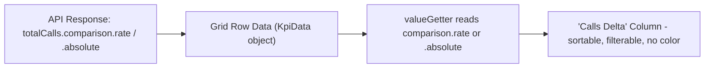

# Add "Calls Delta" Column for totalCalls Comparison

## Context

When time comparison is enabled, the grid already shows change values as inline colored text inside metric cells (via `GroupedDataGridAggregateCellRendererComponent`). Users cannot sort or filter by these values. This ticket promotes the change for `totalCalls` into its own first-class column.

**Acceptance Criteria:**

- With comparison enabled, rate of change and absolute change are available as grid columns with sort and filter.
- Change metrics do not use green/red (or other semantic) color coding.

**Key insight:** No API or server-side changes needed. The `comparison.rate` and `comparison.absolute` fields are already returned on every `KpiData` object when a comparison period is requested.

## Data Flow



## Implementation

### 1. Add `createChangeColumn` method to ColumnBuilderService

**File:** [src/app/core/services/column-builder/column-builder.service.ts](src/app/core/services/column-builder/column-builder.service.ts)

Add a new private method (near line 754, after `createPreviousPeriodColumn`):

```typescript
private createChangeColumn(field: string, headerName: string, comparisonType: string): ColDef {
  const isAbsolute = comparisonType.endsWith('Absolute');
  return {
    field: `${field}Change`,
    headerName: `${headerName} Δ`,
    minWidth: 120,
    sortable: true,
    filter: 'agNumberColumnFilter',
    filterParams: isAbsolute ? NUMBER_FILTER_PARAMS : PERCENTAGE_FILTER_PARAMS,
    valueGetter: (params: any) => {
      const val = params.data?.[field];
      if (val != null && typeof val === 'object' && 'comparison' in val) {
        return isAbsolute ? val.comparison?.absolute ?? null : val.comparison?.rate ?? null;
      }
      return null;
    },
    valueFormatter: (params: { value: unknown }) => {
      if (params.value == null) return '-';
      const num = Number(params.value);
      if (isNaN(num)) return '-';
      const sign = num >= 0 ? '+' : '';
      return isAbsolute ? sign + num.toLocaleString() : sign + (num * 100).toFixed(1) + '%';
    },
  };
}
```

Key design decisions:

- `sortable: true` and `filter: 'agNumberColumnFilter'` (the whole point of the ticket)
- No `cellRenderer` — plain text, no green/red colors
- `valueGetter` reads from `params.data.totalCalls.comparison.rate` or `.absolute` depending on the active comparison mode
- Column appears/disappears based on comparison state (same lifecycle as existing comparison columns)

### 2. Wire into `buildMetricColumns` loop

**File:** [src/app/core/services/column-builder/column-builder.service.ts](src/app/core/services/column-builder/column-builder.service.ts) (inside the `for` loop at ~line 231)

After the existing `includePreviousPeriodColumns` block, add:

```typescript
if (useComparison && metric.field === "totalCalls") {
  result.push(
    this.createChangeColumn(
      metric.field,
      metric.headerName,
      comparison!.comparisonType,
    ),
  );
}
```

This ensures the column only appears for `totalCalls` and only when comparison is active.

### 3. Update `patchCallsColumnLabels` for dynamic header

**File:** [src/app/core/constants/dimension-registry.ts](src/app/core/constants/dimension-registry.ts) (~line 2711)

Add a line to handle the dynamic label ("Mentions Delta" / "Calls Handled Delta"):

```typescript
const changeCol = columnDefs.find((c) => c.field === "totalCallsChange");
if (changeCol) changeCol.headerName = `${label} Δ`;
```

### 4. Update the fallback in the Data Explorer factory

**File:** [src/app/features/data-explorer/factories/data-explorer-grid-column.factory.ts](src/app/features/data-explorer/factories/data-explorer-grid-column.factory.ts) (~line 290, inside `createStandardColumnsWithComparisonFallback`)

Add equivalent inline logic for the `totalCalls` change column after the previous-period column logic, mirroring what `buildMetricColumns` does. This ensures tests that call the factory without DI still produce the correct columns.

### 5. Unit tests

**Files to update:**

- [src/app/core/services/column-builder/column-builder.service.spec.ts](src/app/core/services/column-builder/column-builder.service.spec.ts) — test that `buildMetricColumns` includes `totalCallsChange` column when comparison is enabled, excludes it when not, and verify it reads rate vs absolute correctly
- [src/app/features/data-explorer/factories/data-explorer-grid-column.factory.spec.ts](src/app/features/data-explorer/factories/data-explorer-grid-column.factory.spec.ts) — update column count/field assertions for comparison-enabled scenarios
- [src/app/features/media-campaigns/media-campaigns.component.spec.ts](src/app/features/media-campaigns/media-campaigns.component.spec.ts) — if any specs assert on column definitions with comparison active

## Files Changed (Summary)

| File                                                                         | Type of Change                            |
| ---------------------------------------------------------------------------- | ----------------------------------------- |
| `core/services/column-builder/column-builder.service.ts`                     | Add `createChangeColumn` + wire into loop |
| `core/constants/dimension-registry.ts`                                       | Patch dynamic label for change column     |
| `features/data-explorer/factories/data-explorer-grid-column.factory.ts`      | Update fallback for test parity           |
| `core/services/column-builder/column-builder.service.spec.ts`                | New tests                                 |
| `features/data-explorer/factories/data-explorer-grid-column.factory.spec.ts` | Update existing tests                     |

## What Does NOT Change

- No API / server-side changes (data already returned)
- No new Angular components (plain valueFormatter, no cell renderer)
- No changes to how Data Explorer or Media Campaigns pass options (both already pass `comparison` and `comparisonOptionsEnabled`)
- No changes to the existing inline comparison badge behavior
